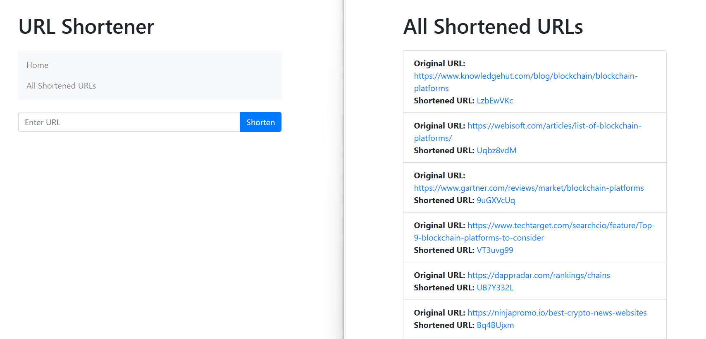

# URL Shortener

URL Shortener is a simple web application built using Python and Flask that allows users to shorten long URLs into concise, shareable links. It also provides a page to view all shortened URLs.

## Features

- Shorten long URLs to create compact links.
- View a list of all shortened URLs.
- Bootstrap for improved visual design.
- SQLite database to store URL mappings.

## Project Structure

- `url_shortener/`: The main project directory.
    - `app.py`: The Flask application code.
    - `db.sqlite`: SQLite database for storing URLs.
    - `templates/`: HTML templates for the web pages.
        - `index.html`: The homepage for shortening URLs.
        - `all_urls.html`: Page to view all shortened URLs.
    - `static/`: Static files like CSS.
        - `styles.css`: Custom CSS for styling.

## Usage

1. Run the Flask application by executing `app.py`.
2. Access the URL shortener in your web browser at `http://localhost:5000/`.
3. Enter a long URL to shorten, and you will receive a shortened URL.
4. Visit the "All Shortened URLs" page to view a list of all shortened URLs.

## Dependencies

- Flask: A micro web framework for Python.
- SQLite: A lightweight database for storing shortened URLs.
- Shortuuid: A library for generating short and human-friendly UUIDs to create unique shortened URLs.
- Bootstrap (via CDN): A front-end framework for styling the web application.

## Contribution

Contributions to this project are welcome. Feel free to submit issues or pull requests.

## License

This project is open-source and available under the [MIT License](LICENSE).